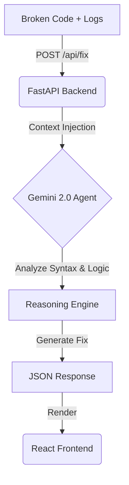

# The Architect: Autonomous Code Repair Agent 🏗️

> **"Current AI writes code but cannot maintain it. The Architect closes the loop."**

. The Architect (Agent Coding)
Focus: Self-Healing Systems & DevOps.
The Problem: Current AI writes code but cannot maintain it.
The Challenge: Build an agent that understands the software development lifecycle (SDLC).
Example: An agent that monitors a GitHub repository, identifies a bug from a log file, reproduces it, writes a test case, fixes the code, and deploys the patch—all without human input.
Example: An agent that refactors a legacy COBOL or Python 2 codebase into modern Rust/Go microservices.


## 📜 The Manifesto
We are done with "copilots" that wait for you to type. **The Architect** is a species of agent designed for the **invisible architecture** of software maintenance. It doesn't just suggest lines; it diagnoses, reasons about, and surgically repairs broken codebases with a single intent.

Built for the **Vetrox AGENTIC 3.0 Hackathon** (Track 1: The Architect).

## 🧠 The Intelligence
Powered by **Gemini 2.0 Flash**, The Architect leverages:
*   **Deep Reasoning:** To understand *why* code failed, not just *where*.
*   **Context Awareness:** Ingests error logs + source code simultaneously.
*   **Deterministic Output:** Returns strictly formatted JSON patches, not conversational filler.

## ⚡ Architecture



## 🚀 Quick Start

### Prerequisites
*   Python 3.10+
*   Node.js 18+
*   Google Gemini API Key

### 1. The Brain (Backend)
```bash
cd backend
python3 -m venv .venv
source .venv/bin/activate
pip install -r requirements.txt

# Create .env file
echo "GOOGLE_API_KEY=your_key_here" > .env

# Start the Architect's Brain
python3 -m uvicorn main:app --reload
```

### 2. The Face (Frontend)
```bash
cd frontend
npm install
npm run dev
```

Visit `http://localhost:5173` to start repairing code.

## 🛠️ Tech Stack
*   **Model:** Google Gemini 2.0 Flash (via `google-genai` SDK)
*   **Backend:** FastAPI (Python)
*   **Frontend:** React + TypeScript + Vite
*   **Styling:** Pure CSS (Clean, Minimalist)

## 🔮 Future Roadmap
- [ ] **GitHub Webhook Integration:** Auto-fix PRs on failure.
- [ ] **Test Generation:** Write unit tests before fixing.
- [ ] **Multi-File Context:** Analyze entire repositories.
